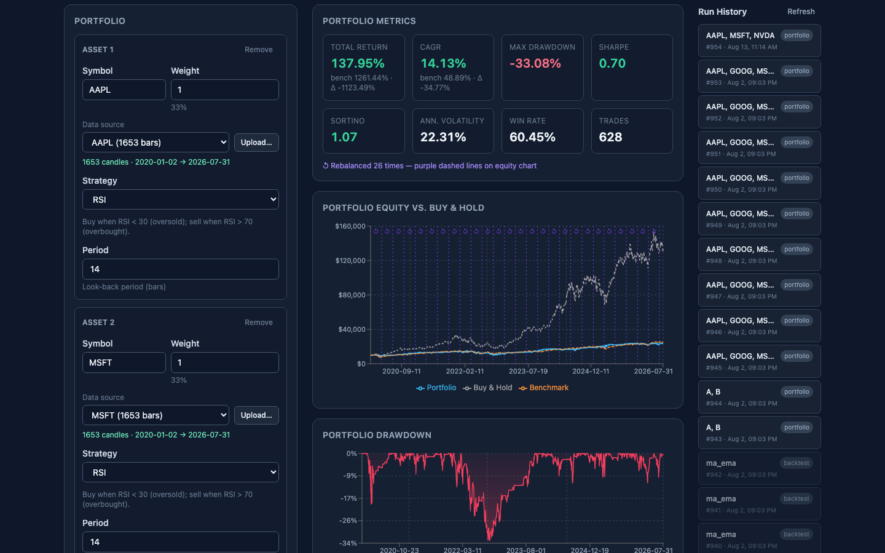

# rusty-finance

**A quantitative backtesting and paper-trading platform — Rust compute core, Python bindings, FastAPI service, React console.**

[](https://github.com/ggange/rusty-finance/actions/workflows/ci.yml)
[](LICENSE)

Backtest technical strategies over real OHLCV data, optimise portfolio weights,
validate out-of-sample with walk-forward analysis, and run the surviving
strategies through a simulated trading loop with risk limits and a kill switch.



## Why this repo might interest you

- **The strategies are tested, then eliminated.** [`docs/strategy-validation.md`](docs/strategy-validation.md)
  runs 5-fold walk-forward validation across five assets and **cuts MACD and EMA
  crossover for negative out-of-sample Sharpe**. Only RSI and Bollinger Bands are
  cleared to trade. Nothing here is promoted on in-sample results.
- **Compute in Rust, orchestration in Python.** The engine, metrics, optimiser
  and walk-forward loop are Rust; PyO3 exposes them to a FastAPI layer, so the
  hot path stays fast without giving up the Python ecosystem.
- **The risk layer fails closed.** Brokers declare `is_live` truthfully, and the
  risk engine refuses to submit through a live venue until limits are configured.
  Order flow is idempotent and reconcilable; a kill switch halts everything.
- **Gradient-projection weight optimisation** onto the simplex, with static and
  dynamically rebalanced policies.
- **CI across all three stacks** — `cargo test`, `pytest`, Vitest + type-checked
  production build, on every push.

## Documentation

| Doc | What it's for |
|---|---|
| **[docs/USER-GUIDE.md](docs/USER-GUIDE.md)** | **Start here if you're using the platform.** A walkthrough of every tab, how to read the metrics, and the mistakes the defaults let you make |
| [docs/READING-LIST.md](docs/READING-LIST.md) | Curated literature behind the engine, with a suggested reading order |
| [docs/strategy-validation.md](docs/strategy-validation.md) | Walk-forward results for all six built-in strategies |
| [docs/ROADMAP.md](docs/ROADMAP.md) | What's built, what's next, and the decision log |
| This README | Installation, build, and troubleshooting reference |

## Disclaimer

This project is **for research and educational purposes only**. It is not
investment advice, and it is not a production trading system.

No component of this repository trades real money. Every bundled broker
(`dry_run`, `paper_sim`, `simulated_paper`) is a simulation, and each reports
`is_live = False`. No brokerage credentials are included or required. Backtested
and walk-forward results are historical simulations that exclude many real-world
frictions; **past performance does not indicate future results**. If you adapt
this code to place real orders, you do so entirely at your own risk.

## Repository layout

```
backtesting/          Rust library — strategies, engine, portfolio, metrics
backtesting-py/       PyO3 bridge — exposes run() and run_portfolio() to Python
api/                  FastAPI server — REST endpoints over the Python bindings
frontend/             Vite + React 18 UI — portfolio form, results dashboard
data/datasets/        CSV files for data-source picker (configurable directory)
data/fixtures/        Synthetic CSV fixtures used by tests
```

## Architecture

```
backtesting (Rust core)
      ↓  path dependency
backtesting-py (PyO3 cdylib)
      ↓  import backtesting_py
api (FastAPI HTTP layer)
```

## Prerequisites

| Tool | Version |
|------|---------|
| Rust | stable (edition 2024) |
| Python | ≥ 3.9 |
| Node.js | ≥ 16 |
| maturin | ≥ 1.0 |

Install Python dependencies: `pip install maturin`

Node dependencies installed via `npm install` in the `frontend/` directory.

## Quick Start

The project uses a Python virtualenv at `.venv/`. Activate it first in any terminal that runs Python commands:

```bash
source .venv/bin/activate   # macOS/Linux
# .venv\Scripts\activate    # Windows
```

If `.venv` doesn't exist yet, create it and install deps:

```bash
python3 -m venv .venv
source .venv/bin/activate
pip install maturin
pip install -e "api/[dev]"
```

Run the full app with three terminals (all from the repo root, with `.venv` active):

**Terminal 1 — Build Python bindings:**
```bash
source .venv/bin/activate
cd backtesting-py
maturin develop
```
(Re-run after Rust changes; bindings are installed into `.venv`.)

**Terminal 2 — Start FastAPI backend:**
```bash
source .venv/bin/activate
uvicorn api.main:app --reload
```
Backend runs at `http://localhost:8000`. Swagger docs at `/docs`.

**Terminal 3 — Start Vite dev server:**
```bash
cd frontend
npm install    # first time only
npm run dev
```
Frontend runs at `http://localhost:5173` and proxies API calls to `localhost:8000` (via `vite.config.ts`).

Open `http://localhost:5173` in your browser.

## Build & Test

### Rust core

```bash
cd backtesting
cargo test          # unit + integration tests
cargo doc --open    # browse rustdoc
```

### Python bindings

```bash
cd backtesting-py
maturin develop     # build and install into current virtualenv
```

### API

Run from the repo root:

```bash
pip install -e "api/[dev]"
uvicorn api.main:app --reload   # start server at http://localhost:8000
pytest api/tests/               # run API tests
```

## CSV Format

The backtesting engine expects CSV files with these headers:

| Column | Type | Description |
|--------|------|-------------|
| Date | YYYY-MM-DD | Bar date |
| Open | float | Opening price |
| High | float | Period high |
| Low | float | Period low |
| Close | float | Closing price |
| Volume | integer | Shares traded |

## Portfolio Weight Optimization

Separate from the parameter sweep (which tunes a *strategy*), this chooses how
much capital each asset gets. Five objectives, all long-only and fully invested:

| Objective | Solves for | Uses mean returns? |
|---|---|---|
| `equal_weight` | 1/n — the baseline that is hard to beat | no |
| `inverse_volatility` | weight ∝ 1/σ, correlation ignored | no |
| `min_variance` | lowest portfolio variance | no |
| `risk_parity` | every asset contributes equal risk | no |
| `max_sharpe` | highest in-sample Sharpe | **yes** |

### Solve weights on their own

```bash
curl -s localhost:8000/portfolio/optimize -H 'Content-Type: application/json' -d '{
  "datasets": ["MSFT.csv", "NVDA.csv", "SPY.csv"],
  "lookback": 252,
  "optimizer": {"objective": "risk_parity", "shrinkage": 0.2}
}'
```

Returns `weights`, `expected_volatility`, `expected_return`, `risk_contribution`,
and `uses_expected_returns`. This is a planning aid fitted to the window you
chose — it is not evidence about the future.

### Backtest a weight policy

Add `weight_policy` to `/portfolio`. **Neither variant can see the future:**

- **`static`** — runs your manual weights for `warmup` bars, solves once on that
  window, then holds. It deliberately does *not* solve over all history and
  allocate from day one; that would set the opening allocation from returns that
  had not happened yet.
- **`dynamic`** — re-solves at every rebalance date from the trailing `lookback`
  window. Defaults to monthly rebalancing if you do not configure a schedule,
  since dynamic weights only take effect at rebalance events.

```bash
curl -s localhost:8000/portfolio -H 'Content-Type: application/json' -d '{
  "assets": [
    {"symbol":"MSFT","source":{"kind":"dataset","name":"MSFT.csv"},"strategy":{"type":"rsi","period":14}},
    {"symbol":"SPY","source":{"kind":"dataset","name":"SPY.csv"},"strategy":{"type":"rsi","period":14}}
  ],
  "initial_cash": 100000,
  "rebalance": {"frequency": {"kind": "monthly"}},
  "weight_policy": {
    "kind": "dynamic",
    "lookback": 252,
    "optimizer": {"objective": "min_variance", "shrinkage": 0.2}
  }
}'
```

The response gains `weight_history`: every change of target weights with the
volatility and risk contribution the optimizer predicted.

### Read the results sceptically

Solving is cheap — 6–15 µs, so 78 monthly re-solves add about 1 ms to a 9 ms run.
Compute was never the constraint. Estimation error is. On the bundled catalog:

```
manual (equal)   return 148.60%   vol 19.81%   sharpe 0.80   maxdd -27.55%
dyn riskparity   return 133.26%   vol 18.80%   sharpe 0.78   maxdd -24.40%
dyn minvar       return  83.05%   vol 16.84%   sharpe 0.63   maxdd -21.65%
dyn maxsharpe    return 193.02%   vol 25.36%   sharpe 0.77   maxdd -34.02%
```

Min-variance did what it promises: lowest volatility and shallowest drawdown.
Max-Sharpe optimized for Sharpe and delivered a *worse* one than equal weight
(0.77 vs 0.80) with the deepest drawdown — it chased trailing means that did not
persist. `shrinkage` (toward the diagonal) and `max_weight` (a position cap) both
exist to damp exactly that. Reproduce the table with:

```bash
cargo run --release -p backtesting --example optimize_bench
```

## Market Data

> **Data provenance.** The bundled CSVs (`AAPL`, `MSFT`, `GOOG`, `SPY`, `NVDA`,
> 2020-01-01 → 2024-12-31) are split- and dividend-adjusted OHLCV bars retrieved
> from Yahoo Finance via [`yfinance`](https://github.com/ranaroussi/yfinance).
> They are included **solely as a small, fixed sample so the project is
> clone-and-run and its results are reproducible** — they are not redistributed
> as a data product, carry no warranty of accuracy, and remain subject to Yahoo
> Finance's terms of use. Regenerate them yourself at any time with `make
> fetch-all`, or point the API at your own licensed data via
> `RUSTY_FINANCE_DATA_DIR`.

Datasets live in `data/datasets/` as one CSV per symbol. Two ways to populate them:

```bash
make fetch TICKER=NVDA          # full download over a date range
make fetch-all                  # full download of the standard 5-symbol catalog
make refresh                    # append only bars newer than what's on disk
make refresh SYMBOLS="AAPL TSLA"
```

`make refresh` is the incremental path: for each symbol it reads the last stored
date, refetches from that bar forward, and merges. Rows are deduplicated on
`Date` with the newly fetched bar winning, so the trailing bar picks up Yahoo's
post-close revisions rather than keeping a stale copy. On a network error or an
empty response the existing CSV is left untouched — a failed refresh never
destroys history.

## Trading Loop (dry-run)

The loop turns a strategy signal on the latest bar into an order intent. It is
**dry-run only** — `DryRunBroker` logs intents and writes them to SQLite; no
broker is connected and no real order can be placed.

Store a plan, and the scheduler will run it:

```bash
curl -X POST localhost:8000/trade/plans -H 'Content-Type: application/json' -d '{
  "plan_id": "paper-rsi",
  "items": [
    {"dataset": "MSFT.csv", "strategy": {"type": "rsi", "period": 14}, "cash_allocation": 10000},
    {"dataset": "NVDA.csv", "strategy": {"type": "rsi", "period": 14}, "cash_allocation": 10000}
  ]
}'

curl localhost:8000/trade/schedule            # cron config, next run, last run
curl -X POST localhost:8000/trade/schedule/run   # run the cycle now
curl localhost:8000/trade/positions
curl localhost:8000/trade/intents
```

An in-process APScheduler starts with the API and fires the cycle on a weekday
cron — refresh every plan symbol's bars, then tick each enabled plan. Defaults
to 16:30 America/New_York, after the US close so the day's final bar is settled.

| Env var | Default | Purpose |
|---------|---------|---------|
| `RUSTY_FINANCE_SCHEDULER` | `1` | Set `0` to disable the scheduler entirely |
| `RUSTY_FINANCE_SCHEDULER_DAYS` | `mon-fri` | Cron day-of-week field |
| `RUSTY_FINANCE_SCHEDULER_HOUR` | `16` | Cron hour |
| `RUSTY_FINANCE_SCHEDULER_MINUTE` | `30` | Cron minute |
| `RUSTY_FINANCE_SCHEDULER_TZ` | `America/New_York` | Scheduler timezone |
| `RUSTY_FINANCE_SCHEDULER_REFRESH` | `1` | Set `0` to tick without fetching data |

Market holidays need no special handling: the cron fires, the refresh returns no
new bars, the strategy re-reads the same last bar, and the buy/sell decision is
idempotent — so a holiday tick is a no-op rather than a duplicate order. The same
property makes `POST /trade/schedule/run` safe to invoke repeatedly.

## Risk Guardrails & Kill Switch

Every order passes through one chokepoint (`api.risk.evaluate`) before it can
reach a broker. Nothing bypasses it.

```bash
# Global limits (fallback for every plan)
curl -X POST localhost:8000/trade/limits -H 'Content-Type: application/json' \
  -d '{"max_position_value": 5000, "max_daily_loss": 500, "max_daily_orders": 10}'

# Per-plan override — layered field-by-field over the global row
curl -X POST localhost:8000/trade/limits -H 'Content-Type: application/json' \
  -d '{"plan_id": "paper-rsi", "max_position_value": 2000}'

curl "localhost:8000/trade/limits?plan_id=paper-rsi"   # effective limits

# Manual halt
curl -X POST localhost:8000/trade/killswitch -H 'Content-Type: application/json' \
  -d '{"engaged": true, "reason": "manual review"}'
curl -X POST localhost:8000/trade/killswitch -d '{"engaged": false}'
```

| Limit | Effect |
|-------|--------|
| `max_position_value` | Rejects an entry whose notional (`qty × price`) exceeds the cap |
| `max_daily_loss` | Blocks new entries once realized loss today reaches the cap |
| `max_daily_orders` | Caps orders submitted per day — a runaway-loop guard |

Two deliberate asymmetries, both toward safety:

* **Limits constrain entries, never exits.** A limit exists to stop the system
  taking on *more* risk; blocking a sell would strand capital in a position the
  strategy wants out of. Risk-reducing orders always pass.
* **The kill switch halts everything, including exits.** A halt that still
  traded would not be a halt. It is stored in SQLite, so a halted system stays
  halted across an API restart until a human explicitly releases it.

Rejected orders are written to the intent log with a `rejected: <reason>` status
and leave the position ledger untouched, so a blocked trade is auditable rather
than invisible. Rejections don't consume the daily order budget.

**Fail-closed for live brokers.** Every broker declares `is_live`. While it is
False (`DryRunBroker`, `SimulatedPaperBroker`) an unconfigured install stays
permissive and the API just warns on boot. The moment a broker reports
`is_live = True`, that inverts: `max_position_value` and `max_daily_loss` must
both be configured or **every order is refused, in both directions** — one
bounds a single mistake, the other bounds a bad day. `max_daily_orders` is a
runaway-loop guard rather than a capital limit, so it stays optional.

## Order Lifecycle & Reconciliation

A venue accepts an order and then fills it over time — partially, or not at all.
So `Broker.submit` returns a `BrokerOrder` carrying `status`, `filled_qty` and
`avg_fill_price`, not a status string.

**The ledger follows what actually filled, never what was requested.** A 25 %
fill on a 200-share order records 100 shares, at the fill price rather than the
signal price. Orders that the venue hasn't finished with are re-polled at the
start of the next tick (`sync_open_orders`) and any newly filled quantity is
topped up, so a partial that later completes doesn't get double-counted.

| Status | Meaning |
|--------|---------|
| `accepted` | At the venue, nothing filled yet |
| `partially_filled` | Some quantity filled; still open |
| `filled` | Complete — terminal |
| `rejected` | Refused by the venue — terminal, ledger untouched |
| `canceled` | Terminal |

```bash
curl "localhost:8000/trade/orders?plan_id=paper-rsi"
curl "localhost:8000/trade/orders?plan_id=paper-rsi&open_only=true"
curl "localhost:8000/trade/reconcile?plan_id=paper-rsi"
```

Reconciliation compares venue-reported holdings against our ledger per symbol,
over the *union* of both sets — a position held on only one side is drift, not
an omission. It runs automatically on every tick, because drift means our record
of reality is wrong and every decision made from it is suspect.

`SimulatedPaperBroker` models partial fills, rejections and adverse slippage so
the lifecycle can be exercised before any vendor is chosen:

```python
SimulatedPaperBroker(fill_ratio=0.4, reject_symbols={"NVDA"}, slippage=0.001)
```

## Choosing a Broker

One environment variable selects the venue; every path that submits orders goes
through `make_broker()`.

| `RUSTY_FINANCE_BROKER` | Behaviour |
|------------------------|-----------|
| `dry_run` *(default)* | Instant complete fills, positions in process memory |
| `paper_sim` | Simulated venue with **books in SQLite** — survives restart |

| Env var | Default | Purpose |
|---------|---------|---------|
| `RUSTY_FINANCE_BROKER_SLIPPAGE` | `0.0` | Fractional adverse slippage (`0.0008` = 8 bps) |
| `RUSTY_FINANCE_BROKER_FILL_RATIO` | `1.0` | `<1` produces partial fills |

An unrecognised broker name falls back to `dry_run` with a warning rather than
failing open into something unexpected. Neither shipped broker is live —
`is_live` is False for both, and `GET /trade/broker` reports what's configured.

Use `paper_sim` for a soak. `dry_run` keeps positions in process memory, so
after a restart it reports an empty venue and reconciliation shows phantom
drift against a perfectly correct ledger. `paper_sim` keeps the venue's own
books in `venue_positions` / `venue_orders`, derived independently of our
ledger, so the comparison still means something after a bounce.

```bash
RUSTY_FINANCE_BROKER=paper_sim \
RUSTY_FINANCE_BROKER_SLIPPAGE=0.0008 \
  uvicorn api.main:app
```

## Soak Reporting

Principle 5: a backtest is evidence, not truth, until the same signals have run
on paper and agreed. `GET /trade/soak` is that comparison.

The backtester assumes a fill at the signal price, so the gap between
`signal_price` and `avg_fill_price` **is** the modelling error, reported in
basis points and signed so positive always means "worse than the backtest
assumed", for both buys and sells.

```bash
curl "localhost:8000/trade/soak?plan_id=paper-rsi"
```

```json
{
  "orders": 22, "filled": 22, "rejected": 0, "fill_rate": 1.0,
  "slippage_bps": { "samples": 22, "mean": 8.0, "worst": 8.0,
                    "note": "positive = execution worse than the backtest assumed" },
  "realized_pnl": 1420.56
}
```

Near-zero mean slippage with a high fill rate is the engine validating itself.
A persistent adverse skew means the backtest is optimistic and its results
should be discounted **before** any capital is risked — that judgement is the
entire point of the soak, and it needs weeks of calendar time that cannot be
compressed.

## Troubleshooting

### Backend

**"Address already in use" when starting uvicorn**
```
ERROR:    [Errno 48] Address already in use
```
Another process is listening on port 8000. Either:
- Kill the process: `lsof -ti:8000 | xargs kill -9`
- Or use a different port: `uvicorn api.main:app --reload --port 8001` (then update frontend proxy in `frontend/vite.config.ts`)

**"ModuleNotFoundError: No module named 'backtesting_py'"**
The Python bindings haven't been built. Run `cd backtesting-py && maturin develop` and ensure you're in the same Python venv.

**"Connection refused" when frontend tries to reach backend**
- Check backend is running: `curl http://localhost:8000/health`
- If using a different backend port, update the proxy in `frontend/vite.config.ts` (line `target: "http://localhost:8000"`)

### Frontend

**"Module not found" or build fails**
```bash
cd frontend
npm install
npm run build
```
Rebuild TypeScript and dependencies.

**Vite dev server port 5173 already in use**
```bash
npm run dev -- --port 5174
```
Use a different port and update your browser URL.

**"Engine unavailable" message in the UI**
The FastAPI backend isn't responding or the bindings aren't built. Check:
1. `.venv` is activated (`source .venv/bin/activate`)
2. `maturin develop` completed successfully (from `backtesting-py/`)
3. `uvicorn api.main:app --reload` is running (from repo root)
4. `curl http://localhost:8000/health` returns `{"status":"ok","engine":"available"}`

### Data

**Dataset dropdown shows "Pick a dataset…" but no options**
- Place CSV files in `data/datasets/` (default, or set `RUSTY_FINANCE_DATA_DIR=<path>`)
- Restart the backend for changes to take effect
- Each CSV must have a `Date, Open, High, Low, Close, Volume` header

**"Unknown dataset" error when running a backtest**
The dataset name doesn't exist in the catalog. Verify the file is in `data/datasets/` and the backend can see it via `GET /datasets`.
